#### 1. Создать новый realm (`demo_realm`)
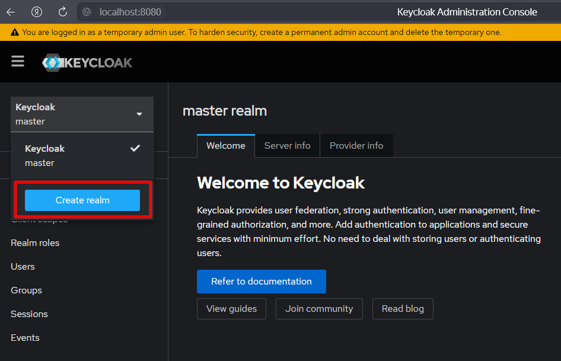
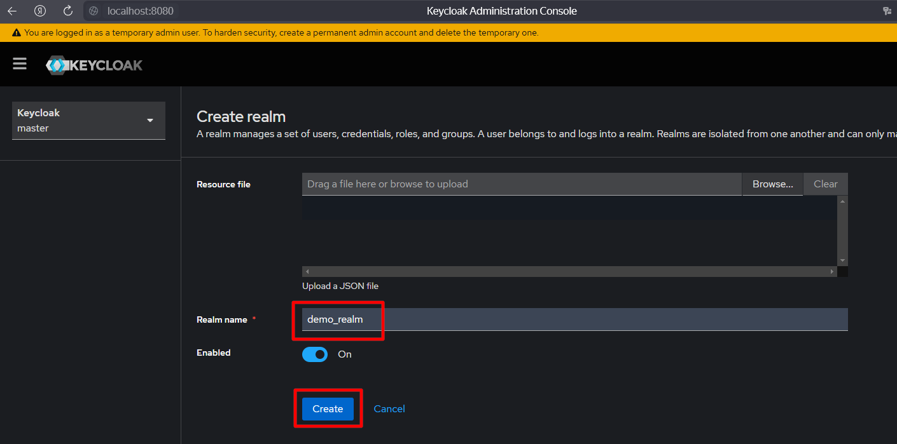

#### 2. Создать клиент (`demo_client`)
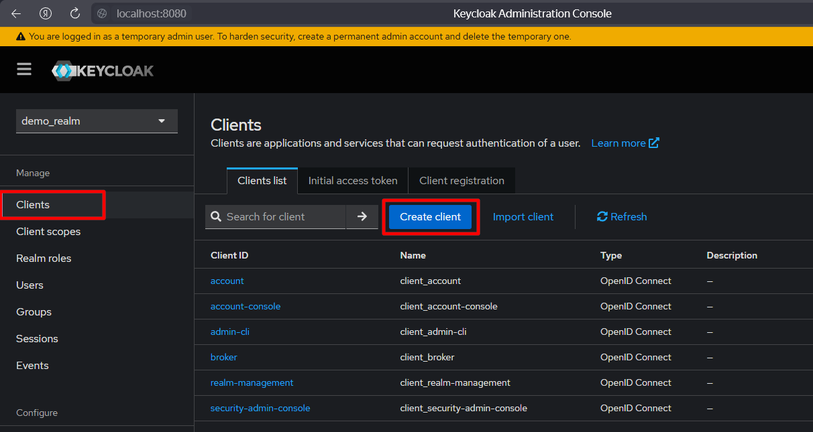
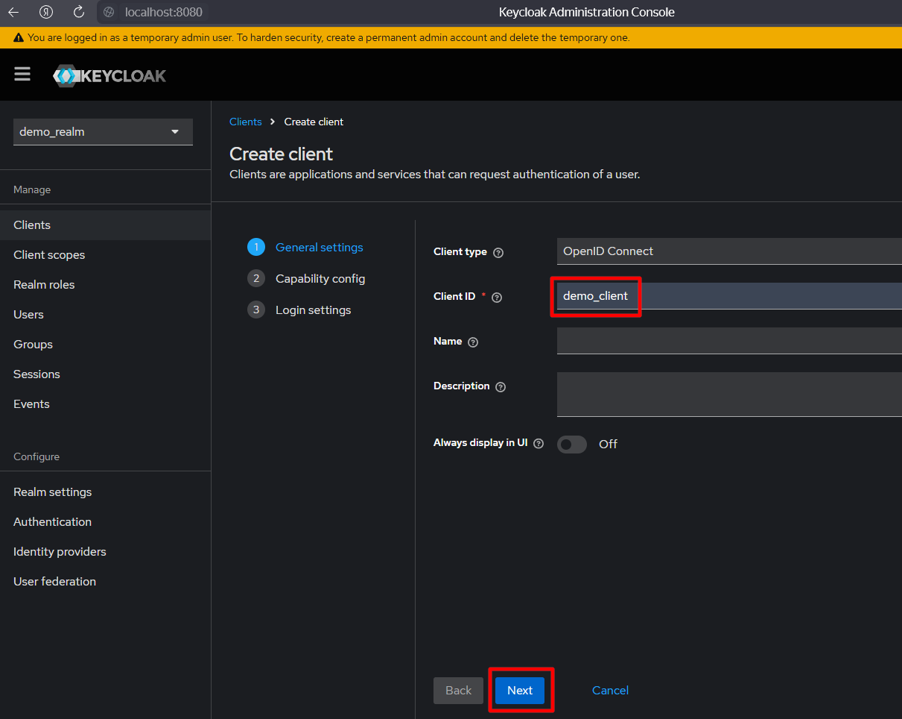

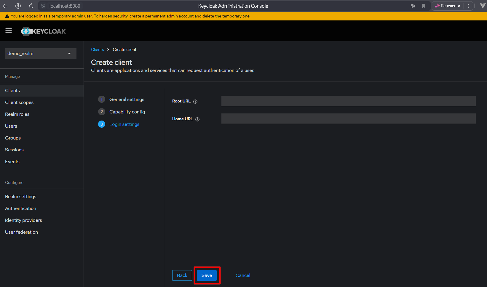

#### 3. Скопировать secret
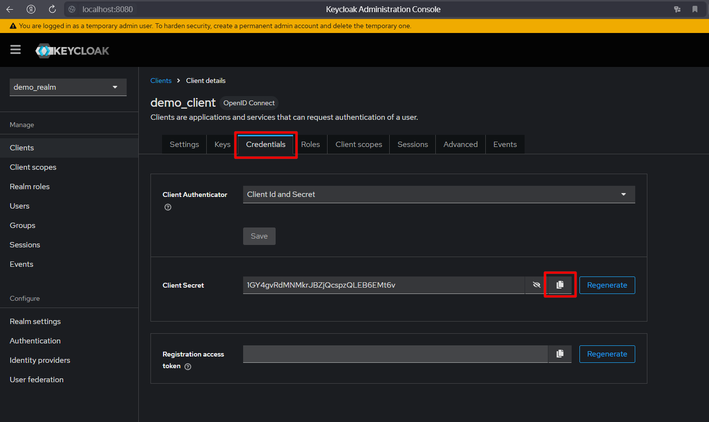
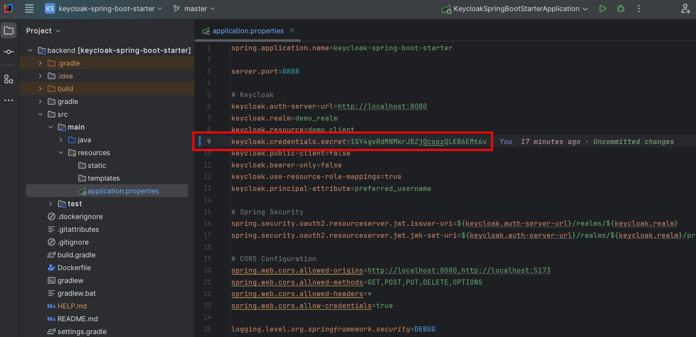

#### 4. Создать пользователя (`demo_user`)
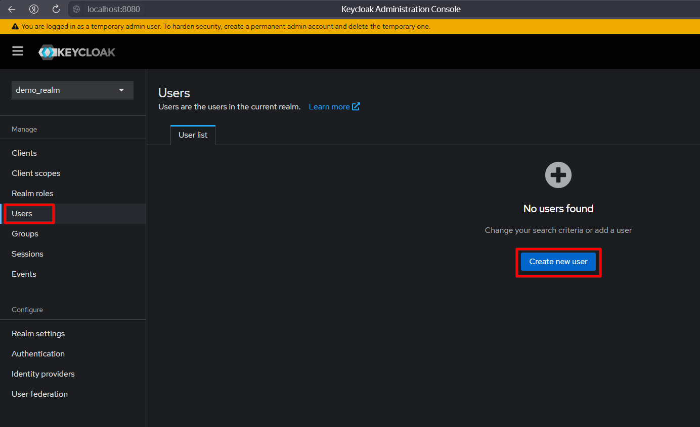
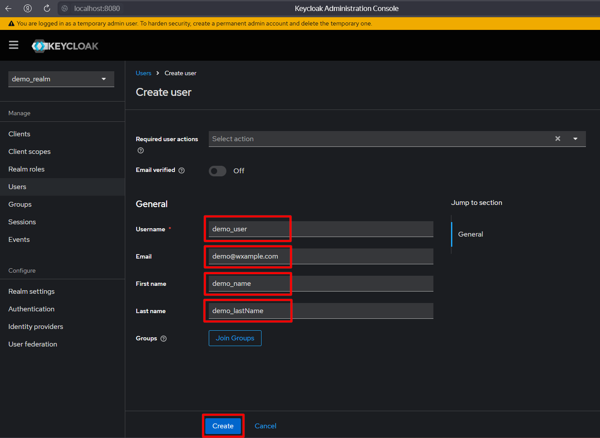

#### 5. Задать пользователю пароль (`1234`, temporary: `off`)
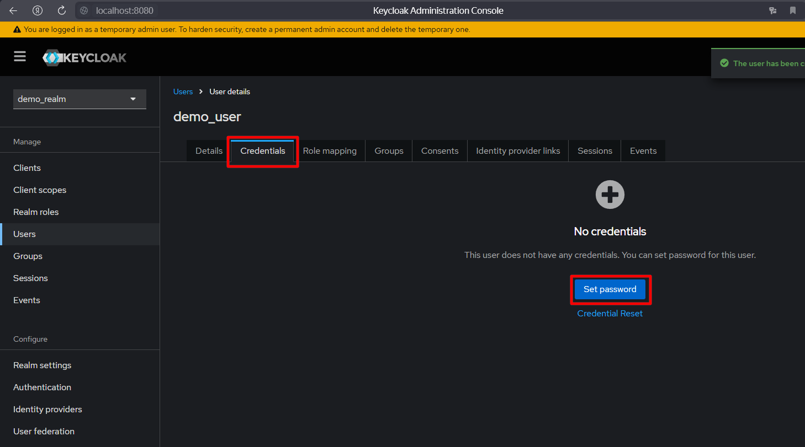
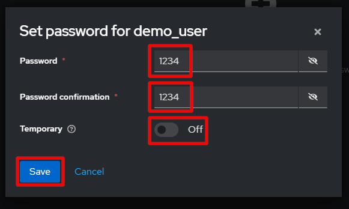
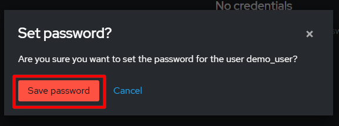