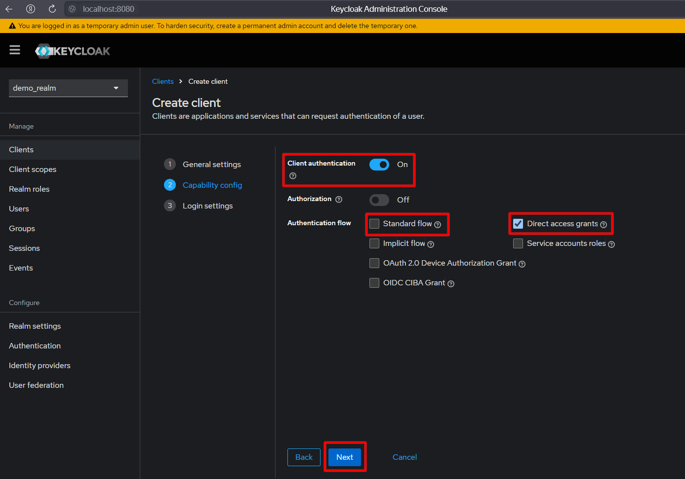

#### 1. Создать новый realm (`demo_realm`)

#### 2. Создать клиент (`demo_client`)

#### 3. Скопировать secret

#### 4. Создать пользователя (`demo_user`)

#### 5. Задать пользователю пароль (`1234`, temporary: `off`)

